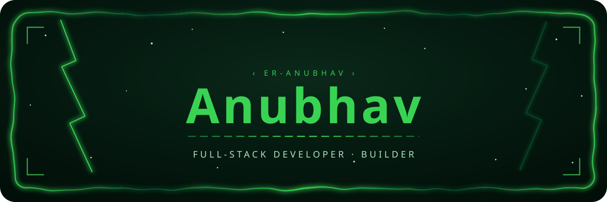
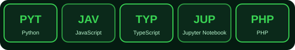

  

 

# Anubhav Tripathi

**AI Systems & Distributed Backend Engineer**  
Founding Engineer @ Orbitron Labs • B.Tech CS (AI/ML) Final Year at AKTU / I.T.S Engineering College

 

### Profile Overview

Computer Science Engineering student (AI & ML, Final Year) architecting stateful agentic workflows, high-concurrency backend microservices, and low-power RTOS firmware across 40+ repositories and private enterprise deployments.

* **Founding Engineer** at **Orbitron Labs** — Architected multimodal AI citizen grievance platform processing 500+ live submissions (60–70% triage reduction).
* **Software Engineering Intern** at **E4A Solution** — Zephyr RTOS C firmware & BLE telemetry engines for medical devices.
* **Software Engineer Intern** at **ITSEC NFED** — Enterprise backend systems & reliable REST microservices.
* **President** of **NexTech Technical Society** & **Google Student Ambassador**.

### What keeps me busy

  

### Technical Capabilities

  

 

#### Agentic AI & Systems Orchestration

#### Distributed Backend & Concurrency

#### Embedded & Hardware Firmware

#### Core Languages & Infrastructure

### Featured Systems & Architecture

  

 

#### Open Source & Flagship Repositories
<table width="100%">
  <tr>
    <td width="33%" valign="top">
      <h4><a href="https://github.com/er-anubhav/agentic-software-engineering">agentic-software-engineering</a></h4>
      
Autonomous software development platform using LangGraph state machine, GraphRAG over Neo4j, and Docker execution sandboxes.

      
      
    </td>
    <td width="33%" valign="top">
      <h4><a href="https://github.com/er-anubhav/ride-matching">ride-matching</a></h4>
      
High-concurrency ride dispatch microservices engine with Redis atomic locks and event-driven state transitions.

      
      
    </td>
    <td width="33%" valign="top">
      <h4><a href="https://github.com/er-anubhav/work2gether">work2gether</a></h4>
      
Distributed real-time collaborative editing platform powered by WebSockets and CRDT synchronization.

      
      
    </td>
  </tr>
</table>

#### Enterprise & Private Deployments
<table width="100%">
  <tr>
    <td width="33%" valign="top">
      <h4>Orbitron Labs Grievance Automation</h4>
      
Multimodal AI citizen grievance triage platform processing 500+ live submissions with 60–70% manual effort reduction.

      
      
    </td>
    <td width="33%" valign="top">
      <h4>E4A Solution BLE Medical Firmware</h4>
      
Low-power embedded C firmware & BLE telemetry engines on Zephyr RTOS with offline-first synchronization.

      
      
    </td>
    <td width="33%" valign="top">
      <h4>ITSEC NFED Digital Platforms</h4>
      
Enterprise REST microservices supporting 100+ institutional deployment users across MSME initiatives.

      
      
    </td>
  </tr>
</table>

### GitHub Analytics & Contribution Footprint

  
    

  
    

  
    

  
  

    

  
  

    

  

### Connect & Links

